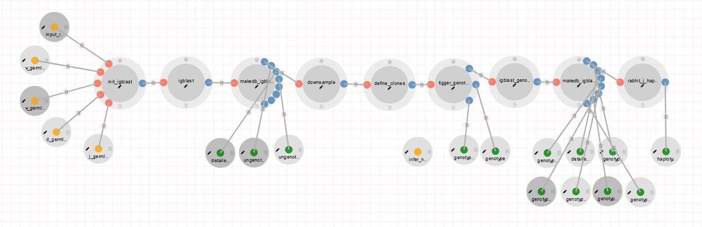
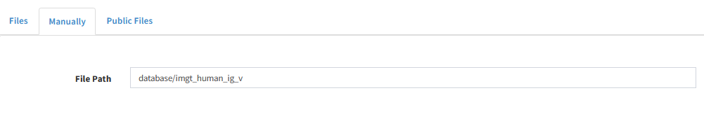
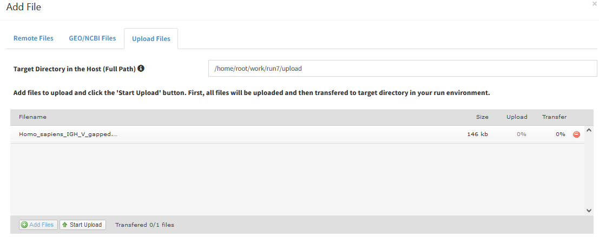
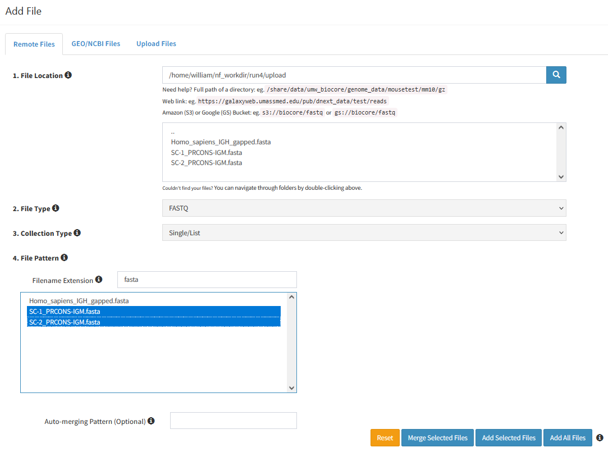

# AIRR-seq annotation pipeline for DolphinNext/Nextflow based on IgBlast, Changeo, Tigger and Rabhit

## Capabilities

- Requires reads that have been run through a pre-processing pipeline such as that provided by [Presto](https://presto.readthedocs.io/en/stable/), and are provided in a single FASTA file per sample.
- Will work either with germline sets distributed with IgBLAST, or custom germline sets
- Derives a personalised genotype (V, D and J are personalised), which can optionally include inferred alleles not present in the V, D and J germline sets
- Derives a personaised haplotype using J anchor genes, using any J genes for which 2 alleles are found in the sample
- Provides annotated reads in [MiAIRR Rearrangement format](https://docs.airr-community.org/en/stable/datarep/rearrangements.html), where calls are based on the personalised genotype.

## Requirements

The pipeline is intended to be used under [DolphinNext](https://dolphinnext.readthedocs.io/en/latest/), although the
.nf file can be used standalone with [Nextflow](https://nextflow.io). Using DolphinNext will provide a user interface for defining the pipeline
parameters, will manage the pipeline execution, and present output files in a convenient form.

Processes are executed in the [immcantation-suite container](https://immcantation.readthedocs.io/en/stable/docker/intro.html) 
under Docker or Singularity. The pipeline requires version 4.4.0 or above. 

## Workflow Setup

- Copy the contents of the 'software' directory to a directory accessible to the machine(s) hosting the workflow.
- Map this directory to the directory /software within the container.
- Example DolphinNext settings for human and macaque workflows are given in human/settings.png and macaque/settings.png. Human settings use germline sets distributed with IgBlast, while the macaque sets are from [kimdb](http://kimdb.gkhlab.se/).

## Setting Up the Germline Sets

### Using Germline Sets provided with IgBlast

Germline sets provided with IgBlast can be found within the Immcantation container at /usr/local/share/igblast/database. To use these 
germline sets, specify the base names of the v, d and j databases as inputs to the workflow. Specify these using the `Manually` tab in DolphinNext file picker,
by specifying the file path, rather than uploading any files. 

For example, for IMGT human IGH, the inputs would be:

- database/imgt_human_ig_v
- database/imgt_human_ig_d
- database/imgt_human_ig_j

An IMGT-gapped V database is also required for the workflow. V-gapped databases are not distributed with IgBlast, but can, for example,
be downloaded from IMGT. The V-gapped database must contain all sequences in the ungapped database. It  doesn't matter if it contains 
other sequences, although they will not be used. If you do not have a gapped database covering all the sequences in the ungapped database, 
you can generate one using the `gap_sequences` tool in the [receptor-utils package](https://williamdlees.github.io/receptor_utils/_build/html/index.html).
Please note that the gapped germline set MUST conform to the 'standard' IMGT alignment with no insertions or deletions: in other words, 
the second conserved cysteine must be at codon 104: this is a requirement of the Changeo package and many other downstream tools. 
Unfortunately IMGT's gapped macaque IG sets have additional insertions and do not meet this requirement. If the gapped set you wish
to use is not conformant, it will need to be fixed up either by hand, or a new set generated with use of the `gap_sequence` tool, if
you can find an older reference set that is properly gapped to use as a model. the gapped V database should be uploaded using DolphinNext.

IgBlast requires a D reference set to be speified for light chain analysis, although it is not used.

In addition to specifying the germline sets, select the species from the dropdown, and the chain to be annotated. Do not specify igblast_ndm or
igblast_aux: these will be configured automatically by IgBlast, based on the species and the chain.

### Using Other Germline Sets

Please refer to [these notes](https://williamdlees.github.io/receptor_utils/_build/html/custom_igblast.html) for guidance on the use of custom 
sets with IgBlast.

Within the pipeline, you can upload the four required reference sets (see notes in the previous section on the gapped V reference set). You can use a 
mix of sets distributed with IgBlast and others: for example you could specify a custom V and use D and J sets provided by IgBlast. Just follow 
the guidance in the previous section for the IgBLAST sets, and upload files for the other sets.

The IgBlast ndm and aux files define the layout of the V and J genes respectively. For V genes, if the species is covered in the IgBlast distribution,
the ndm file in the distribution can generally be used and you do not need to specify an ndm file: just leave it unspecified and ensure that the
species and chain are set correctly. An IgBlast aux file can be used PROVIDED that the IgBlast-supplied J reference set is used. If a custom reference
set is used, and it contains any alleles not listed in the IgBlast distribution, or modifies the sequences of any that are, a custom aux file is 
likely to be required. There are tools in the receptor_utils package mentioned above for creating these files from the reference sets. Please
also refer to the general notes mentioned above, for pitfalls and guidance on verifying correct annotation.

If both ndm and aux files are uploaded, the species parameter will be ignored.

### Setting Other Workflow Options

Provide the reads as an input parameter. If you have multiple repertoires to process, these can be provided as a set. Because DolphinNext currently
does not support sets of FASTA files directly, when you specify a set, set the File Type as FASTQ and set the Filename Extension (two boxes below) as 
fasta.

`sample_limit` specifies the maximum number of sequences per assigned V-allele that should be passed to
sample_clones for clustering. The changeo clustering algorithm is memory intensive: too high a setting can result in long run times and memory
saturation. We recommend leaving this at the default of 2000 in most circumstances.

`detailed_logs` controls whether detailed logs should be created by MakeDb. 

`infer_novel_v_alleles` controls whether Tigger should infer V alleles that were not defined in the reference set.

`CPU` can be set to match the capacity of your servers, bearing in mind that too high a setting can overload memory.

